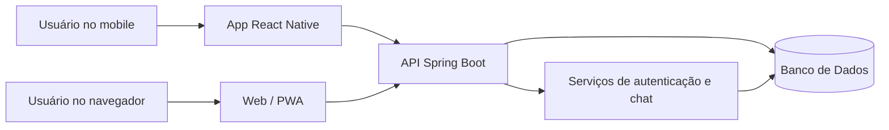
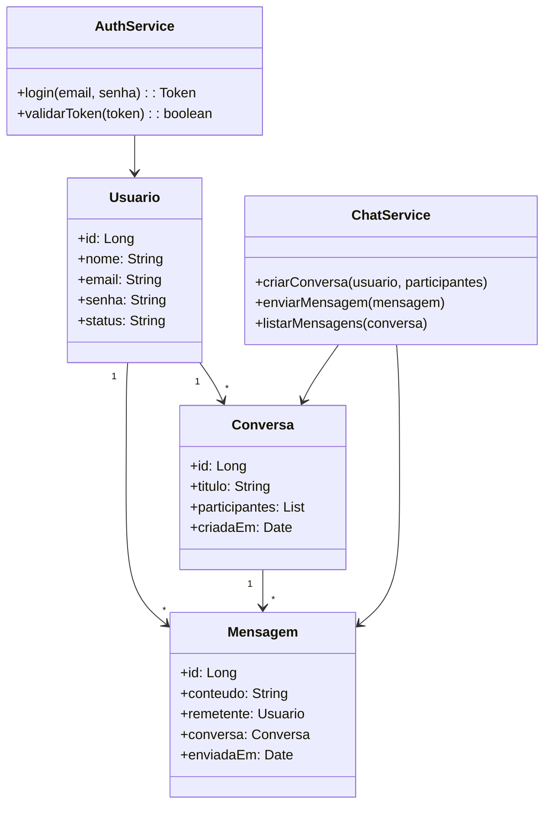
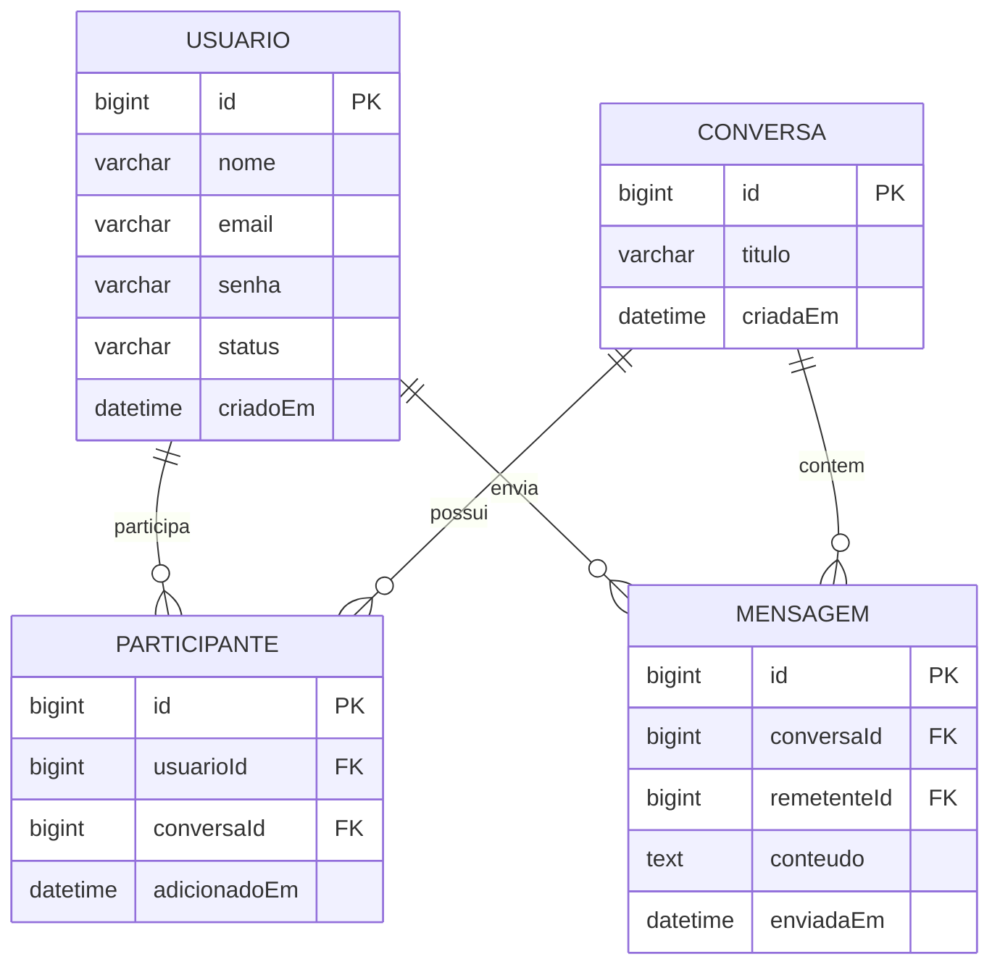

## **Documento de Arquitetura de Software**

**Histórico de Revisão**

|Data|Versão|Descrição|Autor|
| - | - | - | - |
|27/08/2026|0.1|Versão inicial da arquitetura do projeto Experienciando|Equipe do projeto|

## **1. Introdução**

### **1.1 Finalidade**
Este documento tem como objetivo apresentar a visão geral da arquitetura do sistema Experienciando, descrevendo as principais decisões de projeto, componentes, tecnologias e padrões adotados para o desenvolvimento do backend, do aplicativo móvel e da experiência em navegador. A arquitetura foi definida para garantir escalabilidade, manutenção, segurança e boa experiência para os usuários finais.

### **1.2 Escopo**
O escopo do sistema inclui o backend responsável pela gestão de usuários, autenticação, mensagens e regras de negócio do chat; o cliente móvel em React Native para acesso em dispositivos móveis; e a versão web para execução em navegador. Este documento deve orientar a equipe de desenvolvimento, manutenção e evolução da solução, garantindo que a estrutura proposta seja seguida durante o ciclo de vida do projeto.

### **1.3 Definições, Acrônimos e Abreviações**

|Abreviação|Definição|
| - | - |
|API|Application Programming Interface|
|JWT|JSON Web Token|
|RN|React Native|
|REST|Representational State Transfer|
|PWA|Progressive Web App|
|DB|Banco de Dados|
|UI|User Interface|

### **1.4 Visão Geral**
O documento detalha a representação arquitetural do Experienciando, incluindo a escolha por uma arquitetura cliente-servidor com backend centralizado e clientes distribuídos. Também são apresentados os principais requisitos, restrições, visão lógica, organização dos módulos e a visão de implementação de dados e componentes, servindo como base para o desenvolvimento e manutenção do sistema.

## **2. Representação da Arquitetura**
A arquitetura adotada é uma solução cliente-servidor em camadas, com um backend em Spring Boot responsável por centralizar as regras de negócio e persistência, e clientes em React Native para mobile e acesso em navegador. Essa abordagem foi escolhida porque permite reutilizar a mesma lógica de negócio em diferentes plataformas, reduz a duplicação de regras e facilita a manutenção do sistema.

A solução também considera a execução em navegador, possibilitando que a experiência do usuário seja acessível em computadores e dispositivos com suporte web, preservando a mesma API e estrutura de autenticação.

### **2.1 Diagrama de Relações**



## **3. Metas e Restrições de Arquitetura**

|**Restrição**|**Ferramenta**|
| :- | :- |
|Linguagem|Java com Spring Boot; JavaScript/TypeScript para frontend mobile e web|
|Framework|Spring Boot, React Native, Expo ou ambiente web compatível|
|Plataforma|Web, mobile e acesso via navegador|
|Segurança|Autenticação via JWT, validação de entradas, controle de acesso e comunicação segura com HTTPS|
|Idioma|Português, com interface compatível para uso em ambiente acadêmico e de produção|

## **4. Visão Lógica**

### **4.1 Visão geral: Pacotes e Camadas**
A arquitetura lógica do Experienciando é organizada em camadas, seguindo um padrão de separação de responsabilidades:

- Camada de apresentação: responsável pela interface do usuário, tanto no aplicativo móvel quanto na versão web/navegador. Essa camada envia requisições para a API e exibe as respostas em tela.
- Camada de aplicação: concentra os controladores, serviços e fluxos principais da aplicação. É responsável por orquestrar operações, autenticação e processamento das regras do chat.
- Camada de domínio: define entidades, regras de negócio e comportamentos centrais do sistema, como usuários, mensagens, conversas e permissões.
- Camada de infraestrutura: implementa acesso a banco de dados, autenticação, integrações externas e persistência de dados.
- Camada transversal: inclui segurança, logs, configuração e gestão de dependências utilizadas por todas as partes do sistema.

### **4.2 Organização do Código**
A estrutura do projeto pode ser organizada da seguinte forma:

```text
experienciando/
├── backend/
│   ├── src/main/java/com/experienciando/
│   │   ├── controller/
│   │   ├── service/
│   │   ├── model/
│   │   ├── repository/
│   │   ├── security/
│   │   ├── config/
│   │   └── util/
│   └── src/main/resources/
├── mobile/
│   ├── src/
│   ├── components/
│   ├── screens/
│   ├── services/
│   └── navigation/
├── web/
│   ├── src/
│   ├── pages/
│   ├── components/
│   └── routes/
├── docs/
│   ├── architecture.md
│   ├── requirements.md
│   └── ...
├── docker-compose.yml
├── Dockerfile
├── README.md
└── requirements.txt
```

Cada diretório tem responsabilidade específica:
- backend: regras de negócio e processamento do sistema;
- mobile: aplicação móvel em React Native;
- web: interface em navegador com mesma lógica de consumo da API;
- docs: documentação técnica e de requisitos;
- arquivos de infraestrutura: auxiliares para execução local e em containers.

### **4.3 Diagrama de Classes**



## **5. Visão de Implementação**

### **5.1 Diagrama de Entidade-Relacionamento**
O banco de dados atual do Experienciando é modelado como um sistema relacional orientado a conversas e mensagens. A estrutura principal contempla usuários, conversas e mensagens, além da associação entre usuários e conversas.



### **5.2 Diagrama Lógico de Dados**
A estrutura lógica dos dados segue o modelo de persistência relacional, em que:
- usuário é identificado por uma chave primária única e armazena dados de perfil e autenticação;
- conversa representa uma thread de comunicação entre um ou mais participantes;
- participante registra a relação entre um usuário e uma conversa;
- mensagem referencia a conversa e o remetente, armazenando o conteúdo e a data de envio;
- a autenticação e autorização são tratadas em camada separada, utilizando token de sessão e validações de acesso.

### **5.3 Banco de Dados Atual**
O banco de dados atual do sistema foi definido para atender ao fluxo principal do chat, com foco em:
- cadastro e autenticação de usuários;
- criação de conversas entre usuários;
- envio e recuperação de mensagens;
- associação de múltiplos participantes por conversa;
- rastreio temporal das interações.

A modelagem atual mantém consistência entre dados, simplicidade de consulta e facilidade de evolução para novos recursos, como notificações, grupos e histórico de leitura.

## **6. Tamanho e Desempenho**
O sistema deve atender a um volume de uso moderado a alto, considerando múltiplos usuários simultâneos em conversas em tempo real. A API deve possuir capacidade suficiente para processar autenticação, envio e leitura de mensagens sem degradação perceptível da experiência. O uso de uma arquitetura centralizada com backend em Spring Boot permite aumentar a capacidade de processamento e escalabilidade horizontal conforme a demanda cresce.

A infraestrutura deve ser dimensionada para suportar:
- usuários simultâneos em múltiplos dispositivos;
- filas de mensagens e processamento de eventos de chat;
- volume crescente de histórico de mensagens;
- acessos via mobile e navegador sem comprometimento de performance.

## **7. Qualidade**
A arquitetura escolhida favorece vários atributos de qualidade:

- Escalabilidade: o backend centralizado pode ser expandido para atender mais usuários e requisições;
- Manutenibilidade: a separação em camadas facilita correções, evoluções e testes; 
- Reuso: a mesma API atende mobile e web;
- Testabilidade: serviços e regras de negócio ficam isolados em módulos e podem ser validados de forma mais simples;
- Segurança: autenticação, autorização e uso de tokens reforçam a proteção do sistema;
- Portabilidade: o cliente mobile em React Native e a versão web permitem acesso em diferentes ambientes.

## **8. Referências**
- Ferramentas e tecnologias do projeto: Spring Boot, React Native, Java, JavaScript/TypeScript, banco relacional e arquitetura cliente-servidor.
- Documento de requisitos do Experienciando.
- Práticas de arquitetura de software para aplicações web e mobile com backend centralizado.
- Modelos de arquitetura em camadas e autenticação com JWT.
