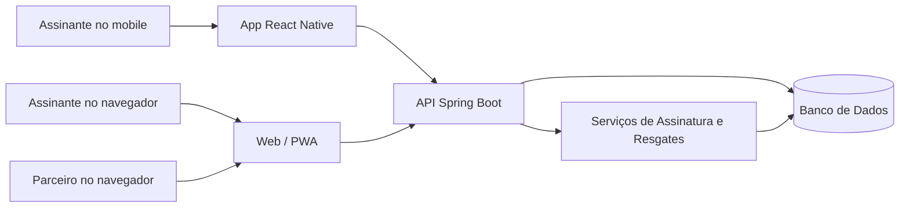
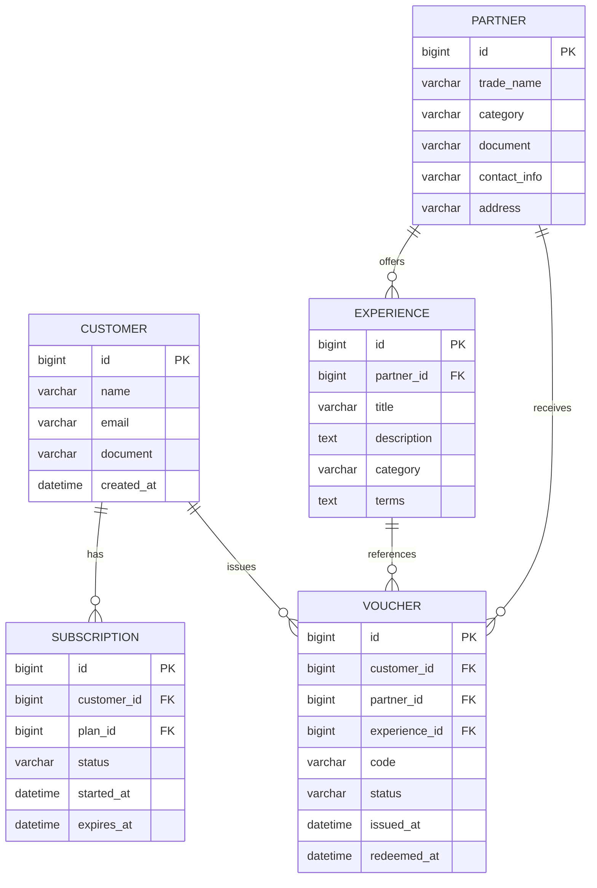

## **Documento de Arquitetura de Software**

**Histórico de Revisão**

|Data|Versão|Descrição|Autor|
| - | - | - | - |
|27/08/2026|0.1|Versão inicial da arquitetura do projeto Plataforma de Assinaturas de Experiências|Equipe do projeto|
|31/08/2026|0.2|Correção: alinhamento com especificação de domínio oficial|Equipe do projeto|

## **1. Introdução**

### **1.1 Finalidade**
Este documento tem como objetivo apresentar a visão geral da arquitetura da Plataforma de Assinaturas de Experiências, descrevendo as principais decisões de projeto, componentes, tecnologias e padrões adotados para o desenvolvimento do backend, do aplicativo móvel e da experiência em navegador. A arquitetura foi definida para garantir escalabilidade, manutenção, segurança e boa experiência para os usuários finais, permitindo a curadoria, disponibilização e gestão de resgates de experiências presenciais.

### **1.2 Escopo**
O escopo do sistema inclui o backend responsável pela gestão de assinantes, parceiros, catálogo de experiências, emissão de vouchers e regras de negócio; o cliente móvel em React Native para acesso em dispositivos móveis; e a versão web para execução em navegador. Este documento deve orientar a equipe de desenvolvimento, manutenção e evolução da solução, garantindo que a estrutura proposta seja seguida durante o ciclo de vida do projeto.

### **1.3 Definições, Acrônimos e Abreviações**

|Abreviação|Definição|
| - | - |
|API|Application Programming Interface|
|JWT|JSON Web Token|
|RN|React Native|
|REST|Representational State Transfer|
|PWA|Progressive Web App|
|DB|Banco de Dados|
|UI|User Interface|
|MVP|Minimum Viable Product|
|CRUD|Create, Read, Update, Delete|

### **1.4 Visão Geral**
O documento detalha a representação arquitetural da Plataforma de Assinaturas de Experiências, incluindo a escolha por uma arquitetura cliente-servidor com backend centralizado e clientes distribuídos. Também são apresentados os principais requisitos, restrições, visão lógica, organização dos módulos e a visão de implementação de dados e componentes, servindo como base para o desenvolvimento e manutenção do sistema.

## **2. Representação da Arquitetura**
A arquitetura adotada é uma solução cliente-servidor em camadas, com um backend em Spring Boot responsável por centralizar as regras de negócio, gestão de assinantes, catálogo de experiências, emissão e validação de vouchers, e persistência de dados. O backend é complementado por clientes em React Native para mobile e acesso em navegador. Essa abordagem foi escolhida porque permite reutilizar a mesma lógica de negócio em diferentes plataformas, reduz a duplicação de regras e facilita a manutenção do sistema.

A solução também considera a execução em navegador, possibilitando que a experiência do usuário seja acessível em computadores e dispositivos com suporte web, preservando a mesma API e estrutura de autenticação.

### **2.1 Diagrama de Relações**



## **3. Metas e Restrições de Arquitetura**

|**Restrição**|**Ferramenta**|
| :- | :- |
|Linguagem|Java com Spring Boot; JavaScript/TypeScript para frontend mobile e web|
|Framework|Spring Boot, React Native, Expo ou ambiente web compatível|
|Plataforma|Web, mobile e acesso via navegador|
|Segurança|Autenticação via JWT, validação de entradas, controle de acesso e comunicação segura com HTTPS|
|Idioma|Português, com interface compatível para uso em ambiente acadêmico e de produção|

## **4. Visão Lógica**

### **4.1 Visão geral: Pacotes e Camadas**
A arquitetura lógica da Plataforma de Assinaturas de Experiências é organizada em camadas, seguindo um padrão de separação de responsabilidades:

- Camada de apresentação: responsável pela interface do usuário, tanto no aplicativo móvel quanto na versão web/navegador. Essa camada envia requisições para a API e exibe as respostas em tela.
- Camada de aplicação: concentra os controladores, serviços e fluxos principais da aplicação. É responsável por orquestrar operações de assinatura, catálogo de experiências, emissão de vouchers e processamento de resgates.
- Camada de domínio: define entidades, regras de negócio e comportamentos centrais do sistema, como clientes, assinantes, parceiros, experiências e vouchers.
- Camada de infraestrutura: implementa acesso a banco de dados, autenticação, integrações externas e persistência de dados.
- Camada transversal: inclui segurança, logs, configuração e gestão de dependências utilizadas por todas as partes do sistema.

### **4.2 Organização do Código**
A estrutura do projeto pode ser organizada da seguinte forma:

```text
plataforma-assinaturas/
├── backend/
│   ├── src/main/java/com/assinaturasexperiencias/
│   │   ├── controller/
│   │   ├── service/
│   │   ├── model/
│   │   ├── repository/
│   │   ├── security/
│   │   ├── config/
│   │   └── util/
│   └── src/main/resources/
├── mobile/
│   ├── src/
│   ├── components/
│   ├── screens/
│   ├── services/
│   └── navigation/
├── web/
│   ├── src/
│   ├── pages/
│   ├── components/
│   └── routes/
├── docs/
│   ├── architecture.md
│   ├── requirements.md
│   └── ...
├── docker-compose.yml
├── Dockerfile
├── README.md
└── requirements.txt
```

Cada diretório tem responsabilidade específica:
- backend: regras de negócio e processamento do sistema;
- mobile: aplicação móvel em React Native;
- web: interface em navegador com mesma lógica de consumo da API;
- docs: documentação técnica e de requisitos;
- arquivos de infraestrutura: auxiliares para execução local e em containers.

### **4.3 Diagrama de Classes**

```mermaid
classDiagram
    class Customer {
        +id: Long
        +name: String
        +email: String
        +document: String
        +created_at: Date
    }

    class Subscription {
        +id: Long
        +customer_id: Long
        +plan_id: Long
        +status: String
        +started_at: Date
        +expires_at: Date
    }

    class Partner {
        +id: Long
        +trade_name: String
        +category: String
        +document: String
        +contact_info: String
        +address: String
    }

    class Experience {
        +id: Long
        +partner_id: Long
        +title: String
        +description: String
        +category: String
        +terms: String
    }

    class Voucher {
        +id: Long
        +customer_id: Long
        +partner_id: Long
        +experience_id: Long
        +code: String
        +status: String
        +issued_at: Date
        +redeemed_at: Date
    }

    class SubscriptionService {
        +createSubscription(customer, plan)
        +cancelSubscription(subscription)
        +validateActiveSubscription(subscription): boolean
    }

    class VoucherService {
        +issueVoucher(customer, partner, experience)
        +redeemVoucher(code): Voucher
        +validateUniquenessRule(customer, partner): boolean
    }

    class CatalogService {
        +listExperiences(): List<Experience>
        +listPartners(): List<Partner>
        +getExperiencesByCategory(category): List<Experience>
    }

    Customer "1" --> "*" Subscription
    Customer "1" --> "*" Voucher
    Partner "1" --> "*" Experience
    Partner "1" --> "*" Voucher
    Experience "1" --> "*" Voucher
    SubscriptionService --> Subscription
    SubscriptionService --> Customer
    VoucherService --> Voucher
    VoucherService --> Customer
    VoucherService --> Partner
    CatalogService --> Experience
    CatalogService --> Partner
```



## **5. Visão de Implementação**

### **5.1 Diagrama de Entidade-Relacionamento**
O banco de dados da Plataforma de Assinaturas de Experiências é modelado como um sistema relacional orientado a assinantes, parceiros, experiências e vouchers. A estrutura principal contempla clientes, assinantes, parceiros, experiências e vouchers, com relacionamentos explícitos e restrições de integridade entre todas as entidades.



### **5.2 Diagrama Lógico de Dados**
A estrutura lógica dos dados segue o modelo de persistência relacional, em que:
- customer é identificado por uma chave primária única e armazena dados de perfil e identificação do assinante;
- subscription representa a vigência e condição de ativação do acesso do cliente ao catálogo;
- partner registra os estabelecimentos parceiros que oferecem experiências;
- experience representa a oferta ou serviço específico prestado pelo parceiro;
- voucher referencia o cliente, parceiro e experiência, armazenando o código identificador, status do cupom e datas de emissão/resgate;
- a autenticação e autorização são tratadas em camada separada, utilizando token de sessão e validações de acesso;
- restrição de unicidade: um customer pode ter apenas um voucher por partner (UNIQUE(customer_id, partner_id)).

### **5.3 Banco de Dados Atual**
Com base no modelo de banco definido para a plataforma, o sistema foi estruturado para atender ao fluxo principal de assinaturas e resgates de experiências, com foco em:
- cadastro e gestão de clientes/assinantes;
- gestão de parceiros e suas experiências;
- criação e gestão de assinativas com ciclo de vida completo;
- emissão ilimitada de vouchers sob regra de negócio (máximo 1 resgate por estabelecimento);
- validação e resgate de vouchers com controle de status;
- rastreio temporal de todas as operações.

#### Entidades principais
| Entidade | Principal finalidade |
| - | - |
| Customer | armazenar dados cadastrais do assinante |
| Subscription | gerenciar a vigência e ativação de acesso ao catálogo |
| Partner | armazenar informações dos estabelecimentos parceiros |
| Experience | registrar as ofertas/serviços dos parceiros |
| Voucher | registrar a emissão de cupons e seu ciclo de vida |

#### Relacionamentos principais
- Um cliente pode ter múltiplas assinativas ao longo do tempo;
- Apenas assinativas com status ativo permitem emissão de vouchers;
- Um parceiro pode oferecer múltiplas experiências;
- Um cliente pode resgatar múltiplos vouchers em diferentes experiências;
- Restrição de unicidade: máximo um voucher por cliente-parceiro (UNIQUE(customer_id, partner_id));
- O histórico de vouchers é persistido para consulta e validação posterior.

A modelagem atual mantém consistência entre dados, simplicidade de consulta, controle de regras de negócio e facilidade de evolução para novos recursos, como notificações, avaliações e análises de uso.

## **6. Tamanho e Desempenho**
O sistema deve atender a um volume de uso moderado a alto, considerando múltiplos assinantes simultâneos navegando catálogo, emitindo e resgatando vouchers. A API deve possuir capacidade suficiente para processar autenticação, consultas de catálogo, emissão de vouchers e validação de resgates sem degradação perceptível da experiência. O uso de uma arquitetura centralizada com backend em Spring Boot permite aumentar a capacidade de processamento e escalabilidade horizontal conforme a demanda cresce.

A infraestrutura deve ser dimensionada para suportar:
- assinantes simultâneos em múltiplos dispositivos e navegadores;
- consultas paralelas ao catálogo de experiências e parceiros;
- volume crescente de histórico de vouchers e resgates;
- acessos via mobile e navegador sem comprometimento de performance;
- processamento rápido de validações e regras de negócio (unicidade, status de assinatura, etc).

## **7. Qualidade**
A arquitetura escolhida favorece vários atributos de qualidade:

- Escalabilidade: o backend centralizado pode ser expandido para atender mais usuários e requisições;
- Manutenibilidade: a separação em camadas facilita correções, evoluções e testes; 
- Reuso: a mesma API atende mobile e web;
- Testabilidade: serviços e regras de negócio ficam isolados em módulos e podem ser validados de forma mais simples;
- Segurança: autenticação, autorização e uso de tokens reforçam a proteção do sistema;
- Portabilidade: o cliente mobile em React Native e a versão web permitem acesso em diferentes ambientes.

## **8. Referências**
- Ferramentas e tecnologias do projeto: Spring Boot, React Native, Java, JavaScript/TypeScript, banco relacional e arquitetura cliente-servidor.
- Especificação de Domínio: Plataforma de Assinaturas de Experiências.
- Documento de requisitos da Plataforma de Assinaturas de Experiências.
- Práticas de arquitetura de software para aplicações web e mobile com backend centralizado.
- Modelos de arquitetura em camadas e autenticação com JWT.
- Padrões de design para gestão de assinaturas e ciclo de vida de cupons/vouchers.
